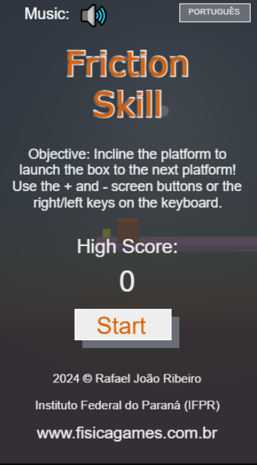
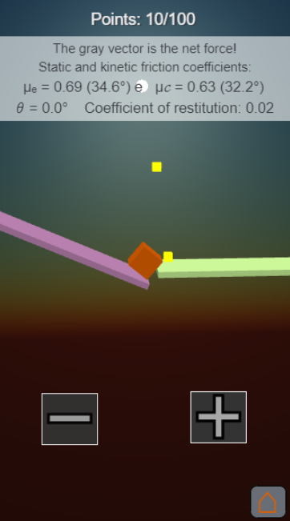
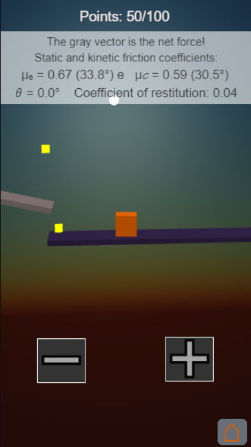
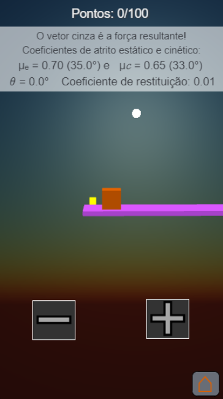

# Friction Skill

## Descrição

**Friction Skill** é um jogo no formato de simulação de física casual que desafia o jogador a mover uma caixa de um plano inclinado para outro, controlando apenas o ângulo de inclinação dos planos. O jogo utiliza simulações avançadas de atrito estático, atrito cinético e coeficiente de restituição, proporcionando uma experiência única e interativa sobre conceitos básicos de física. 

---

## Como Jogar

1. Controle o ângulo de inclinação dos planos usando:
   * Dois botões na tela (sentido horário e anti-horário).
   * Ou as setas esquerda e direita no teclado.
2. Movimente a caixa principal de um plano inclinado para o próximo.
3. Colete as caixas douradas para ganhar pontos.
4. Evite deixar a caixa cair antes de alcançar o próximo plano inclinado.

---

## Funcionalidades

* **Sistema de Pontuação:**
* Caixas douradas coletadas valem **10 pontos** cada.
* Medalhas baseadas na pontuação total:
  * **Prata** : 100 pontos.
  * **Bronze** : 300 pontos.
  * **Ouro** : 600 pontos ou mais.
* **Dinâmica Física Realista**:
* Representação realista da troca entre atrito estático máximo e cinético.
* Coeficiente de restituição crescente a cada plano, criando desafios únicos.
* **Jogabilidade Minimalista**:
* Cenário limpo e intuitivo, com foco na simulação da física.
* **Compatibilidade**:
* Suporte para navegadores e dispositivos móveis, com jogabilidade otimizada para a posição retrato em celulares.

---

## Desafio

O principal desafio do jogo é controlar a caixa quando o atrito diminui e o coeficiente de restituição aumenta, tornando a tarefa de atravessar os planos inclinados mais difícil. Precisão e estratégia são essenciais para avançar sem deixar a caixa cair.

---

## Público-Alvo

Este jogo foi projetado para jovens e adultos curiosos que buscam explorar conceitos de física de maneira casual e interativa. Ideal tanto para finalidades recreativas quanto educativas, sem necessidade de conhecimento prévio.

---

## Telas do Jogo

  

---

## Requisitos para Rodar o Jogo

* **Navegadores Compatíveis** : Qualquer navegador moderno com suporte a WebGL.
* **Dispositivos** : Computadores, tablets e dispositivos móveis (modo retrato).

---

## Tecnologias Utilizadas

* **TypeScript**: Linguagem de programação.
* **Babylon.js**: Motor gráfico 3D.
* **Havok**: Motor de física para simulações realistas.
* **Vite.js**: Ferramenta para build e desenvolvimento.
* **VS Code**: Editor de código.
* **GitHub**: Plataforma de controle de versão.

---

## Instalação

### Pré-requisitos

Certifique-se de ter instalado:

* Node.js
* npm

### Passo a Passo

1. Clone este repositório ou faça o download dos arquivos.
2. Instale as dependências:
   <pre class="!overflow-visible">

bash

<button class="flex gap-1 items-center select-none px-4 py-1" aria-label="Copiar"><svg width="24" height="24" viewBox="0 0 24 24" fill="none" xmlns="http://www.w3.org/2000/svg" class="icon-xs"><path fill-rule="evenodd" clip-rule="evenodd" d="M7 5C7 3.34315 8.34315 2 10 2H19C20.6569 2 22 3.34315 22 5V14C22 15.6569 20.6569 17 19 17H17V19C17 20.6569 15.6569 22 14 22H5C3.34315 22 2 20.6569 2 19V10C2 8.34315 3.34315 7 5 7H7V5ZM9 7H14C15.6569 7 17 8.34315 17 10V15H19C19.5523 15 20 14.5523 20 14V5C20 4.44772 19.5523 4 19 4H10C9.44772 4 9 4.44772 9 5V7ZM5 9C4.44772 9 4 9.44772 4 10V19C4 19.5523 4.44772 20 5 20H14C14.5523 20 15 19.5523 15 19V10C15 9.44772 14.5523 9 14 9H5Z" fill="currentColor"></path></svg>Copiar</button><button class="flex select-none items-center gap-1"><svg width="24" height="24" viewBox="0 0 24 24" fill="none" xmlns="http://www.w3.org/2000/svg" class="icon-xs"><path d="M2.5 5.5C4.3 5.2 5.2 4 5.5 2.5C5.8 4 6.7 5.2 8.5 5.5C6.7 5.8 5.8 7 5.5 8.5C5.2 7 4.3 5.8 2.5 5.5Z" fill="currentColor" stroke="currentColor" stroke-linecap="round" stroke-linejoin="round"></path><path d="M5.66282 16.5231L5.18413 19.3952C5.12203 19.7678 5.09098 19.9541 5.14876 20.0888C5.19933 20.2067 5.29328 20.3007 5.41118 20.3512C5.54589 20.409 5.73218 20.378 6.10476 20.3159L8.97693 19.8372C9.72813 19.712 10.1037 19.6494 10.4542 19.521C10.7652 19.407 11.0608 19.2549 11.3343 19.068C11.6425 18.8575 11.9118 18.5882 12.4503 18.0497L20 10.5C21.3807 9.11929 21.3807 6.88071 20 5.5C18.6193 4.11929 16.3807 4.11929 15 5.5L7.45026 13.0497C6.91175 13.5882 6.6425 13.8575 6.43197 14.1657C6.24513 14.4392 6.09299 14.7348 5.97903 15.0458C5.85062 15.3963 5.78802 15.7719 5.66282 16.5231Z" stroke="currentColor" stroke-width="2" stroke-linecap="round" stroke-linejoin="round"></path><path d="M14.5 7L18.5 11" stroke="currentColor" stroke-width="2" stroke-linecap="round" stroke-linejoin="round"></path></svg>Editar</button>

<code class="!whitespace-pre hljs language-bash">npm install
   </code>

</pre>
3. Para iniciar o servidor de desenvolvimento:
   <pre class="!overflow-visible">

bash

<button class="flex gap-1 items-center select-none px-4 py-1" aria-label="Copiar"><svg width="24" height="24" viewBox="0 0 24 24" fill="none" xmlns="http://www.w3.org/2000/svg" class="icon-xs"><path fill-rule="evenodd" clip-rule="evenodd" d="M7 5C7 3.34315 8.34315 2 10 2H19C20.6569 2 22 3.34315 22 5V14C22 15.6569 20.6569 17 19 17H17V19C17 20.6569 15.6569 22 14 22H5C3.34315 22 2 20.6569 2 19V10C2 8.34315 3.34315 7 5 7H7V5ZM9 7H14C15.6569 7 17 8.34315 17 10V15H19C19.5523 15 20 14.5523 20 14V5C20 4.44772 19.5523 4 19 4H10C9.44772 4 9 4.44772 9 5V7ZM5 9C4.44772 9 4 9.44772 4 10V19C4 19.5523 4.44772 20 5 20H14C14.5523 20 15 19.5523 15 19V10C15 9.44772 14.5523 9 14 9H5Z" fill="currentColor"></path></svg>Copiar</button><button class="flex select-none items-center gap-1"><svg width="24" height="24" viewBox="0 0 24 24" fill="none" xmlns="http://www.w3.org/2000/svg" class="icon-xs"><path d="M2.5 5.5C4.3 5.2 5.2 4 5.5 2.5C5.8 4 6.7 5.2 8.5 5.5C6.7 5.8 5.8 7 5.5 8.5C5.2 7 4.3 5.8 2.5 5.5Z" fill="currentColor" stroke="currentColor" stroke-linecap="round" stroke-linejoin="round"></path><path d="M5.66282 16.5231L5.18413 19.3952C5.12203 19.7678 5.09098 19.9541 5.14876 20.0888C5.19933 20.2067 5.29328 20.3007 5.41118 20.3512C5.54589 20.409 5.73218 20.378 6.10476 20.3159L8.97693 19.8372C9.72813 19.712 10.1037 19.6494 10.4542 19.521C10.7652 19.407 11.0608 19.2549 11.3343 19.068C11.6425 18.8575 11.9118 18.5882 12.4503 18.0497L20 10.5C21.3807 9.11929 21.3807 6.88071 20 5.5C18.6193 4.11929 16.3807 4.11929 15 5.5L7.45026 13.0497C6.91175 13.5882 6.6425 13.8575 6.43197 14.1657C6.24513 14.4392 6.09299 14.7348 5.97903 15.0458C5.85062 15.3963 5.78802 15.7719 5.66282 16.5231Z" stroke="currentColor" stroke-width="2" stroke-linecap="round" stroke-linejoin="round"></path><path d="M14.5 7L18.5 11" stroke="currentColor" stroke-width="2" stroke-linecap="round" stroke-linejoin="round"></path></svg>Editar</button>

<code class="!whitespace-pre hljs language-bash">npm run dev
   </code>

</pre>
4. Para gerar os arquivos de distribuição:
   <pre class="!overflow-visible">

bash

<button class="flex gap-1 items-center select-none px-4 py-1" aria-label="Copiar"><svg width="24" height="24" viewBox="0 0 24 24" fill="none" xmlns="http://www.w3.org/2000/svg" class="icon-xs"><path fill-rule="evenodd" clip-rule="evenodd" d="M7 5C7 3.34315 8.34315 2 10 2H19C20.6569 2 22 3.34315 22 5V14C22 15.6569 20.6569 17 19 17H17V19C17 20.6569 15.6569 22 14 22H5C3.34315 22 2 20.6569 2 19V10C2 8.34315 3.34315 7 5 7H7V5ZM9 7H14C15.6569 7 17 8.34315 17 10V15H19C19.5523 15 20 14.5523 20 14V5C20 4.44772 19.5523 4 19 4H10C9.44772 4 9 4.44772 9 5V7ZM5 9C4.44772 9 4 9.44772 4 10V19C4 19.5523 4.44772 20 5 20H14C14.5523 20 15 19.5523 15 19V10C15 9.44772 14.5523 9 14 9H5Z" fill="currentColor"></path></svg>Copiar</button><button class="flex select-none items-center gap-1"><svg width="24" height="24" viewBox="0 0 24 24" fill="none" xmlns="http://www.w3.org/2000/svg" class="icon-xs"><path d="M2.5 5.5C4.3 5.2 5.2 4 5.5 2.5C5.8 4 6.7 5.2 8.5 5.5C6.7 5.8 5.8 7 5.5 8.5C5.2 7 4.3 5.8 2.5 5.5Z" fill="currentColor" stroke="currentColor" stroke-linecap="round" stroke-linejoin="round"></path><path d="M5.66282 16.5231L5.18413 19.3952C5.12203 19.7678 5.09098 19.9541 5.14876 20.0888C5.19933 20.2067 5.29328 20.3007 5.41118 20.3512C5.54589 20.409 5.73218 20.378 6.10476 20.3159L8.97693 19.8372C9.72813 19.712 10.1037 19.6494 10.4542 19.521C10.7652 19.407 11.0608 19.2549 11.3343 19.068C11.6425 18.8575 11.9118 18.5882 12.4503 18.0497L20 10.5C21.3807 9.11929 21.3807 6.88071 20 5.5C18.6193 4.11929 16.3807 4.11929 15 5.5L7.45026 13.0497C6.91175 13.5882 6.6425 13.8575 6.43197 14.1657C6.24513 14.4392 6.09299 14.7348 5.97903 15.0458C5.85062 15.3963 5.78802 15.7719 5.66282 16.5231Z" stroke="currentColor" stroke-width="2" stroke-linecap="round" stroke-linejoin="round"></path><path d="M14.5 7L18.5 11" stroke="currentColor" stroke-width="2" stroke-linecap="round" stroke-linejoin="round"></path></svg>Editar</button>

<code class="!whitespace-pre hljs language-bash">npm run build
   </code>

</pre>

---

## Licença de Uso e Distribuição

**Copyright (c) 2025 Rafael João Ribeiro**

### Direitos de Uso:

* Distribuição permitida em sua forma original.
* Uso comercial da versão publicada permitido, desde que não sejam feitas alterações no conteúdo.
* Modificações no código-fonte ou redistribuição do mesmo são proibidas sem autorização explícita.

### Aviso sobre Bibliotecas de Terceiros:

Este projeto utiliza:

* **Babylon.js** : Licenciado sob a Licença Apache 2.0.
* **Vite.js** : Licenciado sob a Licença MIT.

---

## Autor

**Prof. Dr. Rafael João Ribeiro**
Instituto Federal do Paraná (IFPR)
[www.fisicagames.com.br](http://www.fisicagames.com.br)
