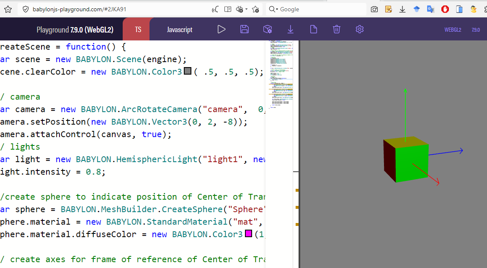

# GUI Editor

End https://gui.babylonjs.com/#JSGZVD#53

Start: https://gui.babylonjs.com/#JSGZVD#45

# Color palette

[https://colorhunt.co/palette/143f6bf55353feb139f6f54d
]()

#143F6B

#F55353

#FEB139

#F6F54D

rgb(20, 63, 107)

rgb(245, 83, 83)

rgb(254, 177, 57)

rgb(246, 245, 77)

# Havok Physics Basic

[https://playground.babylonjs.com/#WXSQIF#2]()

[https://playground.babylonjs.com/#FLCVX1#3]()

[https://playground.babylonjs.com/#RQIZD3#1]()

Collision with specific object "sphere" detect:

[https://playground.babylonjs.com/#QEZ3EE#4]()

# [Unable to load Havok plugin (error while loading .wasm file from browser)](https://forum.babylonjs.com/t/unable-to-load-havok-plugin-error-while-loading-wasm-file-from-browser/40289)

https://github.com/michealparks/babylon-template/blob/main/src/physics.ts

[https://forum.babylonjs.com/t/unable-to-load-havok-plugin-error-while-loading-wasm-file-from-browser/40289/44?u=rafaelj]()

# Why WASM is not the future of Babylon.js

[https://babylonjs.medium.com/why-wasm-is-not-the-future-of-babylon-js-5832b09c9b10]()

# Axis: ver extensões Babylon.js

[https://doc.babylonjs.com/toolsAndResources/utilities/World_Axes]()

[https://www.babylonjs-playground.com/#2JKA91]()

# Custom font with jQuery

[https://www.babylonjs-playground.com/#J3X1EJ#2]()
